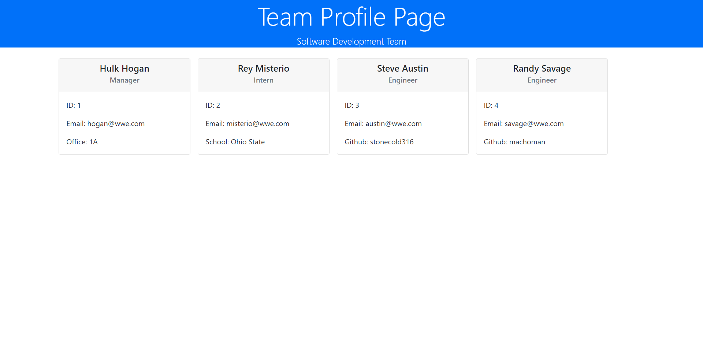

# profile-generator 
Team Profile Generator


  
## Description
***

To help the upper management of an organization to have a better understanding of their teams, an automated Team Profile generator was created. The **Team Profile Generator** prompts the user for a series of questions that will be used to create the employee profile information. Profiles for three roles can be created using the script: Manager, Intern, and Engineer. The profile will contain common employee information such as Name, Employee ID, Email; and specific information such as Office Number for Managers, GitHub username for Engineers and school for Interns. An HTML file will be generated and will contain the information for each employee. This script was created to run in the **Node JS** runtime environment.


## Table of Contents
***  

- [Installation](#installation)
- [Usage](#usage)
- [How to Contribute](#How)
- [Tests](#Tests)
- [Questions](#Questions)
- [License](#license)

  
  
## Installation
***

  The installation can be completed by following these instructions:
    
1. To install a Node JS project, install [Node JS](https://nodejs.org/)       

2. Clone the GitHub repository to you local computer. Click on the following link.
 
  * Repository link : https://github.com/jcorozco81/profile-generator


Additional packages required: [Inquirer package](https://www.npmjs.com/package/inquirer). 

1. To install inquirer initialize the repository with a ```package.json``` file by running ```npm init -y```.

2. Install inquirer and add it to the list of dependencies by running ```npm i inquirer --save```.

  


## Usage
***

   1. To execute the script, open a Git terminal on the main project folder (cloned folder) Run the following command: ```node index.js```.

   2. A series of questions will be displayed, all the answers will be used to generate the file that contains the employees profile information. If the file is successfully created it will return a message indicating that the file was created. The filename of the file created is ```READ-ME.md``` and it will be created in the ```./dist``` folder.

         

* A video with a demo of the script of the script can be obtained here: https://drive.google.com/drive/folders/11x_L55BLAIqM_6dOeltPIBbfVCq85bug?usp=sharing
  


## How to Contribute
***

  Developers who are interested in contributing ideas for this application must agree to follow and comply with the Contributor Covetnant: Code of Conduct. The Contributor Covenant Code of Conduct can be found in the following address:

  [Contributor Covenant Code of Conduct](https://www.contributor-covenant.org/version/2/0/code_of_conduct/code_of_conduct.md/)


## Tests
***
  Four **Test Suites** were created for this project: ```Employee.test.js```, ```Engineer.test.js```, ```Intern.test.js```, and ```Manager.test.js```. These **Test Suites** will be used to test the library script files outputs and initialization.

1. Install Jest and add it to the list of dependencies by running ```npm install --save-dev jest```. Refer to [Jest Documentation](https://jestjs.io/docs/getting-started) for more information.

2. Execute the command ```npm run test```.


## Questions
***
  
  You can find additional projects on my github page: https://github.com/jcorozco81.

  If you have any questions please contact me at my E-Mail address: jcorozco@gmail.com.


## License
***

Copyright (c) 2021 jcorozco81.


This software/code is licensed under the MIT License; to use this software/code you must agree to follow and comply the License. A copy of the License can be found at:

https://www.mit.edu/~amini/LICENSE.md
